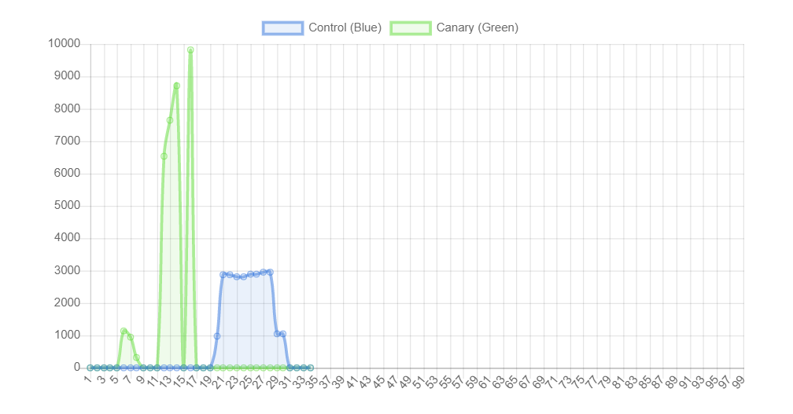
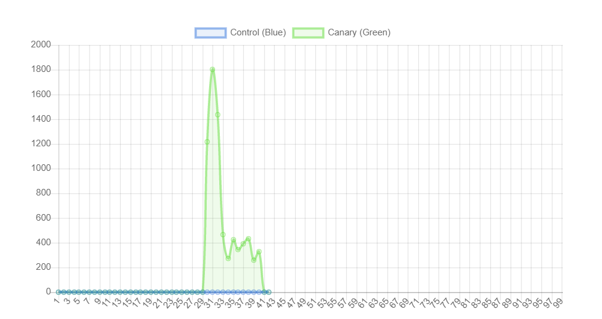
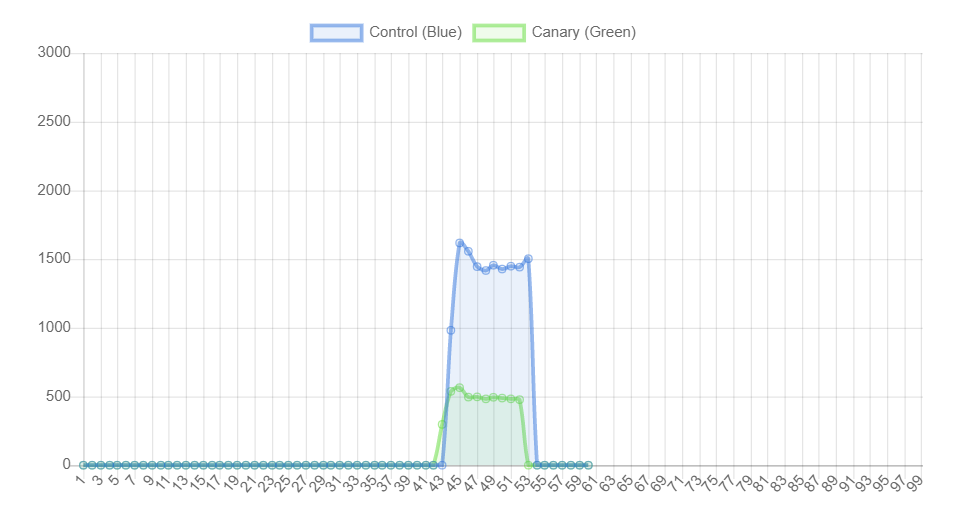
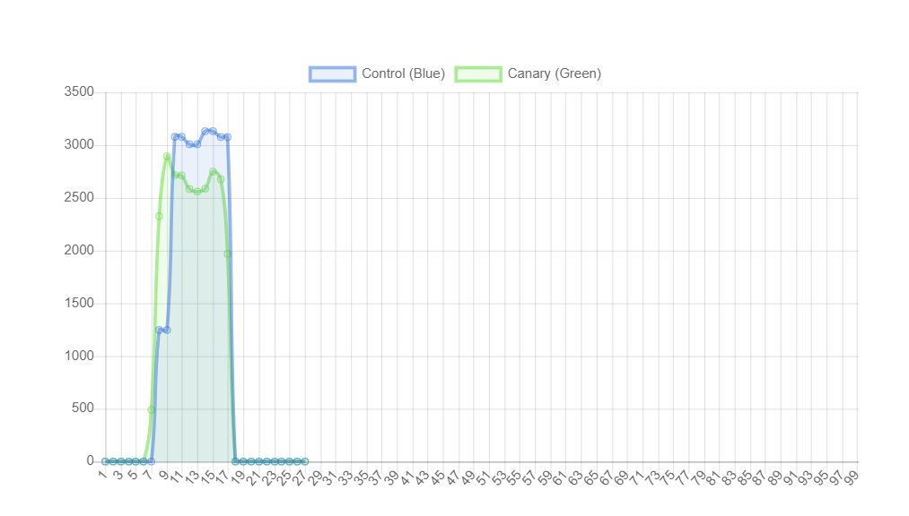
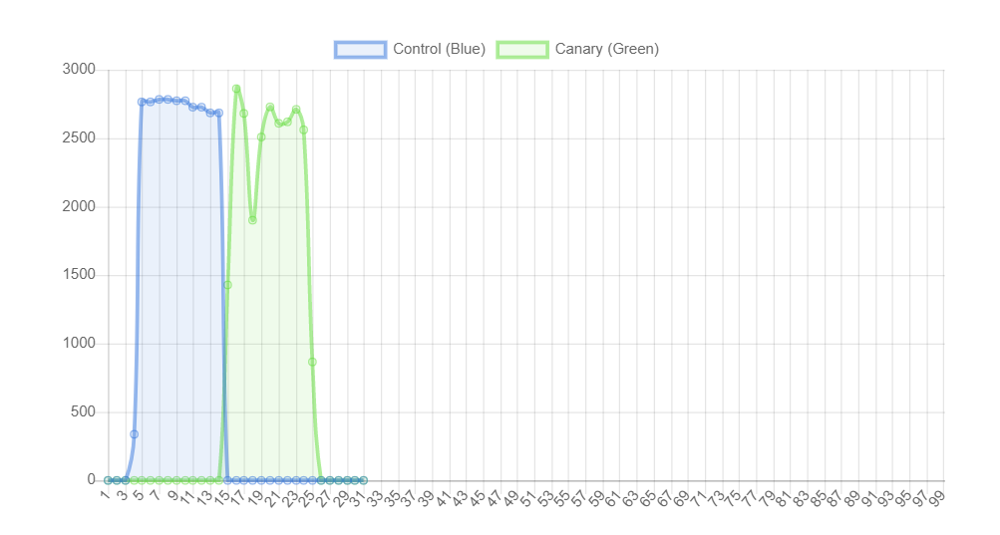
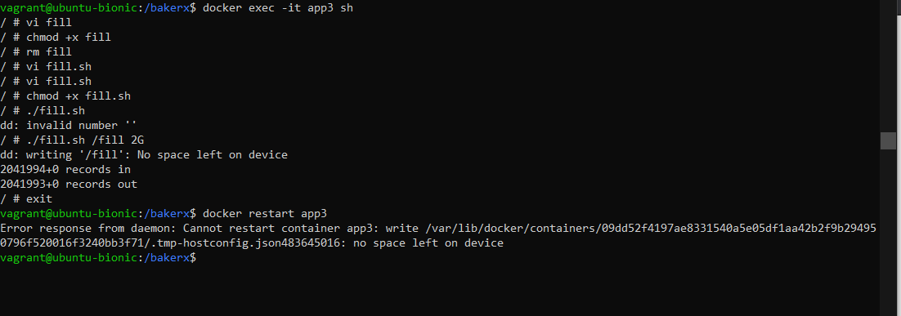

# Chaos

> Chaos is a ladder.

We will explore basic fault and event injection to understand how a simple service responds to different events. This workshop will be a bit more exploratory than some of our other workshops, so this will be a good chance to practice using Docker.


### Setup

Pull the image needed for this workshop.

```bash
bakerx pull CSC-DevOps/Images#Spring2020 chaos
```
Clone the repository.

```bash
git clone https://github.com/CSC-DevOps/Chaos
```

Open a terminal inside the directory and install npm packages.

```bash
cd chap
npm install
# One more inner set of packages for dashboard.
cd dashboard
npm install
```

Inside the `Chaos\chap` directory, start the instances:

```bash
cd chap
node index.js up
```


After the instances intialize, start the dashboard service.

```
node index.js serve
```

You should see a dashboard available on your host machine http://localhost:8080/

### Dashboard


The dashboard displays your running infrastructure.  The container's overall health is visualized by a small colored square. 

A line chart displays statistics gathered from the `/health` endpoint. A sidebar menu displays some options for updating the line chart. By clicking the "CPU Load" menu item, you will see the CPU load be compared between the two servers. By clicking the "Latency" menu item, you will see the Latency as calculated by the average time for a request to be serviced between successive health check calls.

## Tools of Chaos

Inside the /chaos directory, we will find several scripts that will in general cause mayhem, including:

* Burning up the CPU.
* Filling up the disk.
* Dropping random packets.
* Killing processes/containers.

Many of the scripts use traffic control, an advanced tool for setting networking policy. For example, running this will corrupt 50% of network packets.

    tc qdisc add dev enp0s8 root netem corrupt 50%

## Burning up the CPU of a single docker container. 💥

We will conduct a simple experiment where we will induce a heavy CPU load on container within the green canary server. We will then observe differences in metrics across the control and canary server.

Enter the green canary server (`bakerx ssh greencanary`). Then, let's open up a shell within one of the docker containers:

```
docker exec -it app1 sh
```

Then, let's add the [cpu script](chaos/chaos_cpu.sh), and execute it:

```
vi chaos_cpu.sh
chmod +x chaos_cpu.sh
```

Run it.

```
./chaos_cpu.sh
```

### Observations

Induce load on the green canary server.

    siege -b -t30s http://192.168.44.102:3080/stackless

Now, induce load on the control server.

    siege -b -t30s http://192.168.44.102:3080/stackless

You should see something like this:



We see a large increase in latency in green canary server, meaning client requests are taking much longer (and may be timing out).
This is because our round-robin load balancer ignores cpu load, it will continue to route requests to an overloaded instance, who will take much longer in servicing requests. The implication is that we should be mindful of avoiding routing to overloaded instances, which can increase quality of service.


## Network traffic 🚦

Inside our green canary server (`bakerx ssh greencanary`), run the following:

    /bakerx/chaos_network_corruption.sh

Alternatively, you can also directly run:

   tc qdisc add dev enp0s8 root netem corrupt 50%

Task: Try inducing load on the green canary server using:

`siege -b -t30s http://192.168.44.102:3080/stackless`

### Observations:



We see spikes in the latency of the green canary. Since our chaos tool corrupts 50% of the network packets, the load to the green canary is effectively 50% of the original. Hence, we see the latency drop since the load itself has dropped

Once you are done, you can reset the connection with:

    /bakerx/chaos_reset.sh


## Killing and starting containers 😵

Inside the green canary server, you can stop the running containers with `docker stop`.
Stop the app1 and app2 containers;

```
docker stop app1 app2
```

Generate load to the containers using `siege`

### Observations:



The latency of the green canary is surprisingly lesser than that of the blue baseline. We believe that this is because there is no overhead associated with routing the traffic between the different containers of the green canary.

You can restore the containers again by starting them up with the following commands:
```
docker run --rm --name app1 -d -p 127.0.0.1:3005:3000/tcp app-server
docker run --rm --name app2 -d -p 127.0.0.1:3006:3000/tcp app-server
# docker run --rm --name app3 -d -p 127.0.0.1:3007:3000/tcp app-server
```

## Squeeze Testing 🔽

By default a Docker container allocates unlimited cpu and memory. Try limiting the available cpu and memory settings with running the container. You can use these parameters:

```
--cpus=".05"
-m 100k
```

### Observations:

latency squeeze testing:


Original latency graph:



We observed no significant difference in the latencies of the canary with the docker containers with lesser memory and cpus vs the original containers

## Filling disks ⛽

1. Inside one of the containers (e.g., using `docker exec -it app3 sh`), add and run the command to fill the disk: `./fill_disk.sh /fill 2G`.

2. Kill the container and start it again. What happened



3. Try to create a file inside another container.
Yes, we are able to create a new container

🔴 **What surprising fact did you learn?**
We are able to create a file in another container, since the memory is shared between docker containers.

## Reflection


